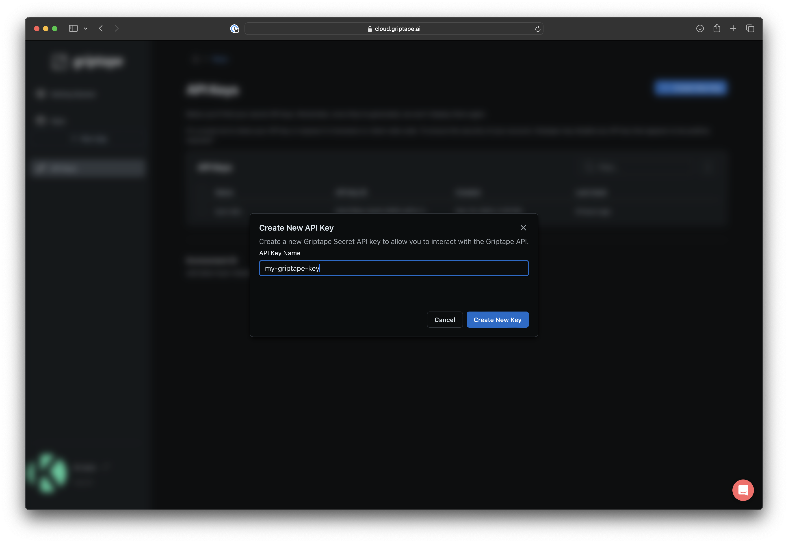

### Create an API Key
Griptape's CLI and API use API Keys for authentication. In the left hand navigation bar, click on __API Keys__.

Click the __+ Create API Key__ button on the top left of the API Key page. A dialog box will appear. Name your API Key something appropriate and click __Create New Key__ to continue. 

!!! warning

    You will be prompted to safely store your API Key. Make sure to do this as you can not view it again once you dismiss the dialog. 

### Delete an API Key
To delete an API Key, select it in the API Key table, click the Kebab Menu button on the top right of the grid. Select __Delete Selected__. This action is irreversible. 

