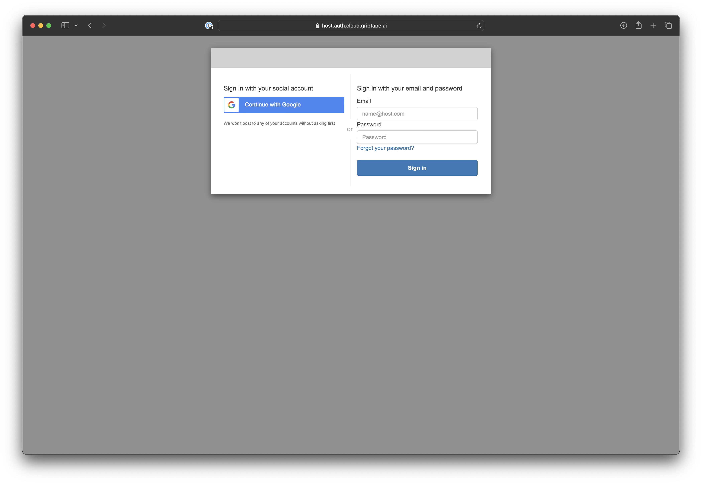
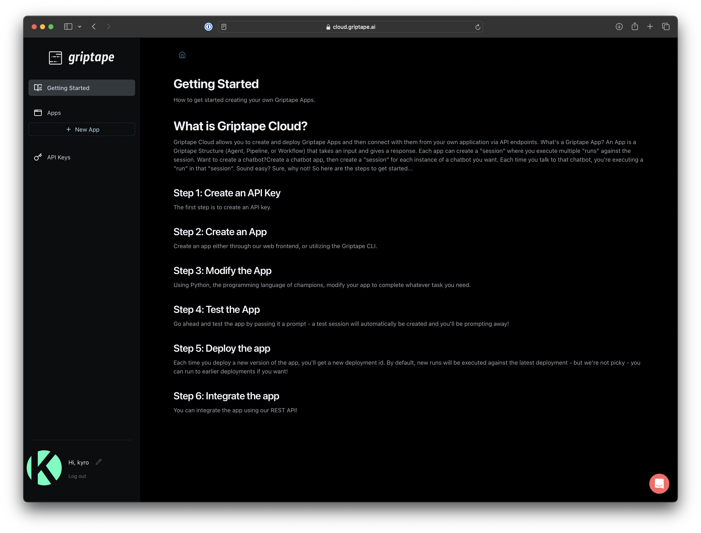
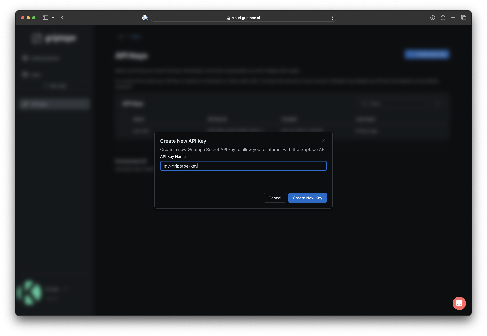

# Login to Griptape Cloud (Private Preview)
Click the link from your Griptape Cloud invitation email or navigate directly to the [Griptape Cloud Private Preview](https://cloud-preview.griptape.ai/) console.

### Welcome to Griptape Cloud
WHen you first login to Griptape Cloud, you'll land on a Getting Started page that describes the basic steps in the first run experience. 

For the purposes of this quick start, we're going to start by creating an API Key. 

### Create you API Key
Griptape's CLI and API use API Keys for authentication. In the left hand navigation bar, click on __API Keys__.

Click the __+ Create API Key__ button on the top left of the API Key page. A dialog box will appear. Name your API Key something appropriate and click __Create New Key__ to continue. 

!!! warning

    You will be prompted to safely store your API Key. Make sure to do this as you can not view it again once you dismiss the dialog. 

## Next Steps
Now that you have an API Key, you can follow either getting started path to create your first app. If you want to work locally, you can follow the [Getting Started using CLI](quickstart-cli.md) tutorial. If you'd rather stay in the browser and start with a sample project, you can follow the [Getting Started using Samples](quickstart-samples.md) tutorial. 