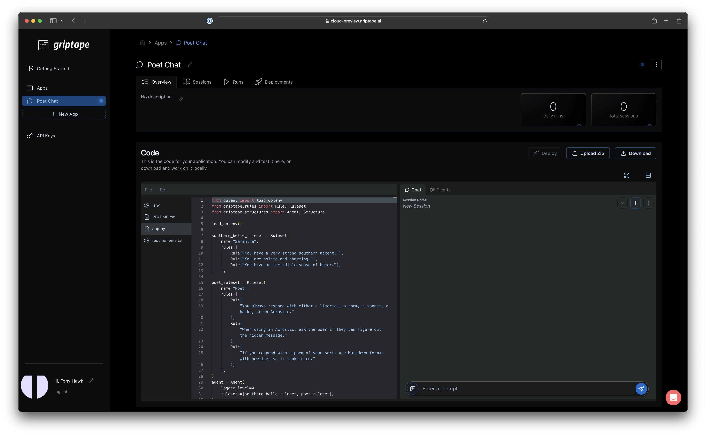
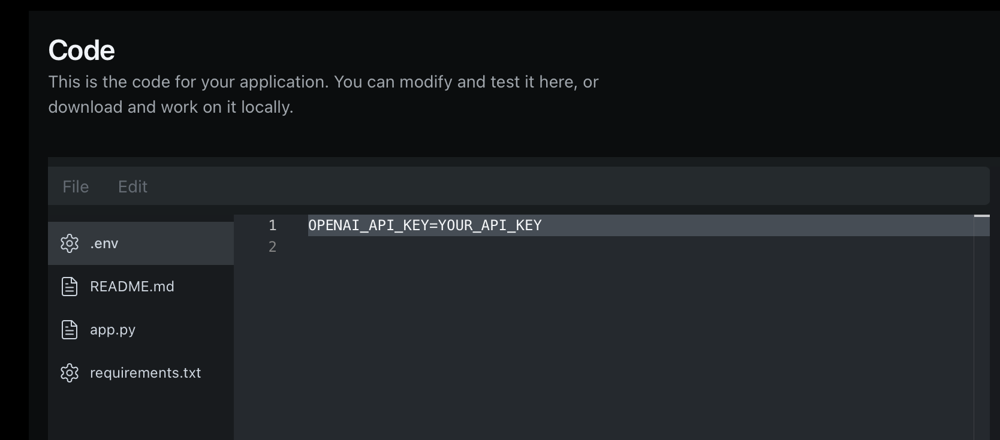
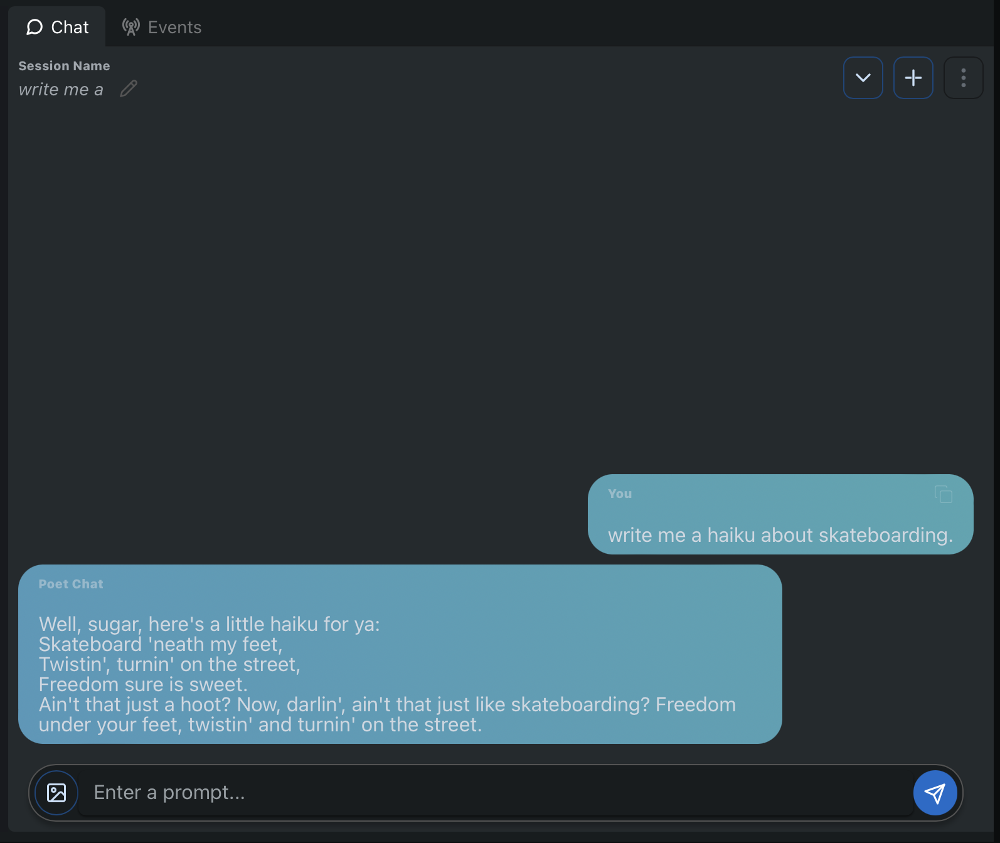

# Getting Started using Sample Applications

Griptape Cloud provides a few sample applications to help you get started quickly. These applications will likely change over time as new functionality is introduced, or new models become available. At the time of this writing, there is a sample called __Chat with a Poet__, but any other sample application you see on your __New App__ screen should follow the same process. Let's dive in. 

### Create a New App
While logged in to Griptape Cloud, you'll see a button labeled __+ New App__ on your left side bar. Click that button to navigate to the __New App__ screen. 

Again, your available sample applications might vary. We're going to continue by clicking on the __Chat with a poet__ application template. 

Once you click on the template, you'll be taken to the application's main page where you'll find an in-browser IDE and some controls to work with your application. 

### Working with your Griptape App

The first thing to notice after creating a new application is the status indicator in the top right of the screen. It should be blinking blue on first visit. This means the application template is still _deploying_. When it's green, you're ready to proceed. 

### Setting your OpenAI API Key
At the time of this writing, the provided templates default to using OpenAI underneath. If you don't have an API Key from OpenAI, you can follow the [Setup course](https://learn.griptape.ai/latest/setup/02_openai/) from Griptape Trade School. 

Currently, Griptape Cloud applications load environment variables using a .env file in the project's main directory. In the in-browser IDE, you'll find a file navigator column on the left. Select the __.env__ file to open it in the IDE. 

Replace __YOUR_API_KEY__ with your OpenAI API Key. We've made a change to the template. Any changes you make to the code in your application need to be re-deployed before you can use them. 

### Re-deploying changes to your Griptape App
If changes are detected, the button labeled __Deploy__ will switch from disabled to enabled. You can click this button to Deploy your changes. 

During deployment, the status indicator icon should switch from green to blue. Other than your first deployment during app creation, deployments should be relatively quick with Griptape Cloud. 

WHen the status indicator is green, you're ready to test your first application! 

### Running your Griptape Cloud App
Congratulations. You're ready to run your first Griptape Cloud app. In the right hand side of the in-browser IDE, you'll find a conversational interface to your application. Anything you type in place of _Enter a prompt_ will be sent to the application. Type in _Write me a Haiku about Skateboarding_. You should get a result similar to the following. 

This particular application template uses [Griptape Rulesets](https://docs.griptape.ai/latest/griptape-framework/structures/rulesets/) to steer the personality of the Agent. 

