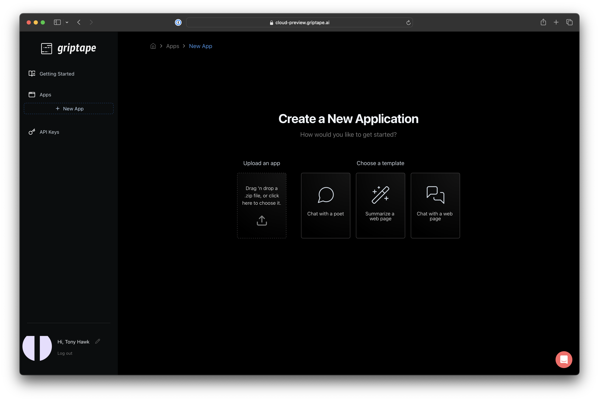
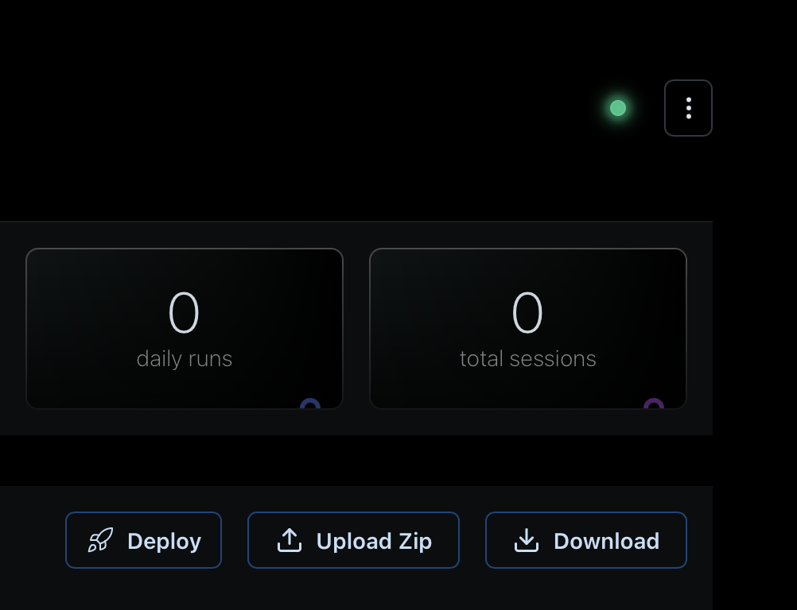

# Create an application from scratch

You can deploy a Griptape Cloud app using the Griptape CLI or the web browser interface. To deploy an app using the Griptape CLI, follow the [Getting Started using CLI](quickstart-cli.md) tutorial. To get started using one of the prebuilt sample applications, follow the [Getting Started using Samples](quickstart-samples.md) tutorial. If you're feeling adventurous and you want to create an application from scratch, continue with the following instructions.

### Creating an application from scratch 
Griptape Cloud expects a certain structure within your application. 

!!! note "Your .zip archive file should contain the following files at the root directory, not in a sub-directory."


| Filename | Description                                                                                                                                                            |
|----------|------------------------------------------------------------------------------------------------------------------------------------------------------------------------|
| app.py | This is the main entry point for you application. Griptape Cloud will look for an `init_structure` method that returns a supported Griptape structure such as an Agent, Pipeline, or Workflow | 
| .env | Currently, Griptape Cloud uses .env files to set application environment variables. This file should have KEY=VALUE pairs for any variables you'd like set in your application's container |
| requirements.txt | The list of libraries your application depends upon inclusive of the version of the __griptape__ framework you are targetting. |

Here is a sample application template you can use as a starting point for your app. 

```py title="app.py" 
from dotenv import load_dotenv
from griptape.structures import Agent, Structure

load_dotenv()

def init_structure(*args, **init_params) -> Structure:
    return Agent()
```
Your _requirements.txt_ file should look like this. Add any other dependencies you wish to be installed into your application's runtime environment. 

```py title="requirements.txt" 
griptape==0.21.1
python-dotenv
```

### Preparing for upload
Griptape Cloud expects a zip file when you're uploading your own application from your local machine. You can zip your application files using whatever method you choose, but ensure that the __app.py, requirements.txt, and .env__ files are all in the top level directory of your archive. 

!!! tip

    If you're on a Mac, navigate into your application directory and run `zip -r app.zip . -x "__MACOSX"` to avoid zipping the Mac file system directories. This won't break your application, but they will show up in the Cloud IDE. 

At this point, you're ready to upload your application to Griptape Cloud. 
##E Uploading your application to Griptape Cloud
While logged in to Griptape Cloud, you'll see a button labeled __+ New App__ on your left side bar. Click that button to navigate to the __New App__ screen. 



CLick on the __Upload an app__ icon. A file upload dialog will appear. Select the zipped application archive and click __Upload__.

### Running your app on Griptape Cloud

Naviate to your application's main page using the left side navigation bar. When the application is first being deployed, you'll find a blue indicator light on the top left side of the page. When it's green, you're ready to proceed. 



Congratulations. You're ready to run your first Griptape Cloud app. In the right hand side of the in-browser IDE, you'll find a conversational interface to your application. Anything you type in place of _Enter a prompt_ will be sent to the application.

### Poetry users (unsupported, but functional)
Alternatively, you can use poetry. It will take care of locking dependencies for you, although it has its own requirements such as needing a pyproject.toml file.

`poetry export --without-hashes --format=requirements.txt > requirements.txt`

**Do I zip up the whole folder (including the .venv) or do I zip just the app.py and requirements.txt? What about the .env file?**

Zip up the app.py, requirements.txt, and .env file. Make sure requirements.txt and .env files are at the top of the directory, rather than inside a folder.
