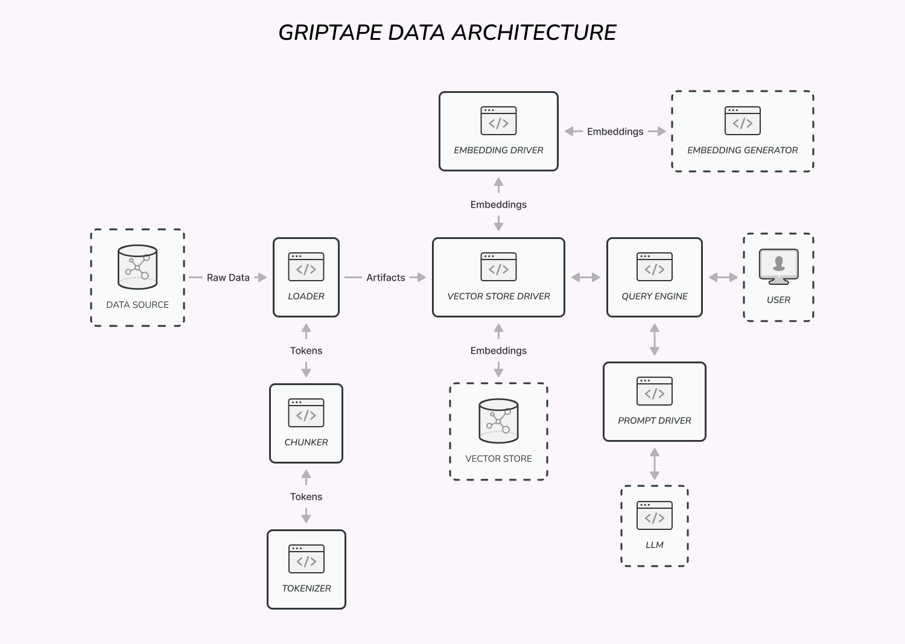

## Overview
Griptape provides several abstractions for working with data.

**Artifacts** are used for passing different types of data, such as text, lists, and blobs, between Griptape components.

**Embedding Drivers** are used to generate vector embeddings from text.

**Loaders** are used to load textual data from different sources.

**Chunkers** are used to split arbitrarily long text into chunks of certain token length.

**Tokenizers** are used to tokenize and detokenize text in order to track LLM token limits.

**Query Engines** are used to search text storages.

**Vector Store Drivers** are used to store and query vector databases.

**Prompt Drivers** are used to call LLM APIs.
