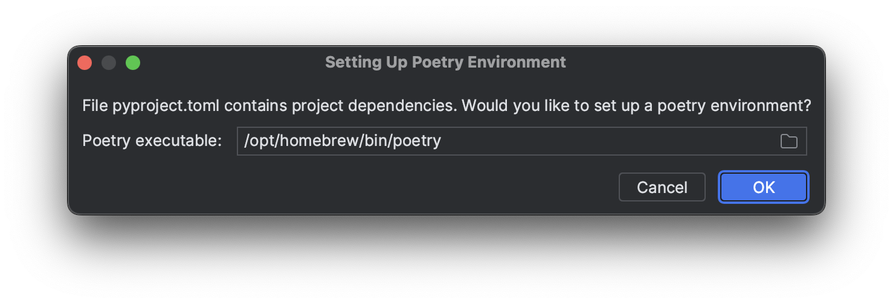
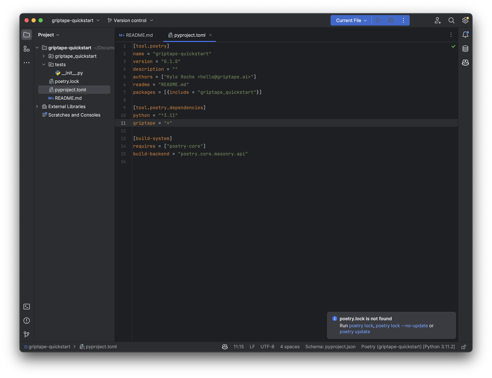

**Griptape** offers developers the ability to build AI systems that operate across two dimensions: predictability and creativity.

For **predictability**, software structures like sequential pipelines and directed acyclic graphs (DAGs) are enforced. **Creativity**, on the other hand, is facilitated by safely prompting LLMs with [tools](https://github.com/griptape-ai/griptape-tools) that connect to external APIs and data sources. Developers can move between these two dimensions according to their use case.

## Quick Start

First, configure an OpenAI client by [getting an API key](https://beta.openai.com/account/api-keys) and adding it to your environment as `OPENAI_API_KEY`. Griptape uses [OpenAI Completions API](https://platform.openai.com/docs/guides/completion) to execute LLM prompts and to work with [LlamaIndex](https://gpt-index.readthedocs.io/en/latest/index.html) data structures.

### Using pip

Install **griptape** and **griptape-tools**:

```
pip install griptape griptape-tools -U
```

### Using Poetry

To get started with Griptape using Poetry first create a new poetry project from the terminal: 

```
poetry new griptape-quickstart
```

If you're using PyCharm, open the directory, and you'll be prompted to setup the Poetry environment.:



Add `griptape = "*"` to your **pyproject.yml** file. You should notice PyCharm asking if it should run `poetry update`. The answer is yes:



### Build a Simple Pipeline

With Griptape, you can create *structures*, such as `Agents`, `Pipelines`, and `Workflows`, that are composed of different types of tasks. Let's define a simple two-task pipeline that uses tools and memory:

```python
from griptape.memory.structure import ConversationMemory
from griptape.memory.tool import TextToolMemory, BlobToolMemory
from griptape.structures import Pipeline
from griptape.tasks import ToolkitTask, PromptTask
from griptape.tools import WebScraper, TextProcessor, FileManager
from griptape import utils

# Tool memory enables LLMs to store and manipulate data
# without ever looking at it directly.
text_tool_memory = TextToolMemory()
blob_tool_memory = BlobToolMemory()

# Connect a web scraper to load web pages.
web_scraper = WebScraper(
    memory={
        "get_content": {
            "output": [text_tool_memory]
        }
    }
)

# TextProcessor enables LLMs to summarize and query text.
text_processor = TextProcessor(
    memory={
        "summarize": {
            "input": [text_tool_memory]
        },
        "query": {
            "input": [text_tool_memory]
        }
    }
)

# File manager can load and store files locally.
file_manager = FileManager(
    memory={
        "load": {
            "output": [blob_tool_memory]
        },
        "save": {
            "input": [text_tool_memory, blob_tool_memory]
        }
    }
)

# Pipelines represent sequences of tasks.
pipeline = Pipeline(
    memory=ConversationMemory()
)

pipeline.add_tasks(
    # Load up the first argument from `pipeline.run`.
    ToolkitTask(
        "{{ args[0] }}",
        tools=[web_scraper, text_processor, file_manager]
    ),
    # Augment `input` from the previous task.
    PromptTask(
        "Say the following in spanish: {{ input }}"
    )
)

result = pipeline.run(
    "Load https://www.griptape.ai, summarize it, and store it in griptape.txt"
)

print(
    utils.Conversation(pipeline.memory)
)
```

Boom! Our first LLM pipeline with two sequential tasks generated the following exchange:

> Q: Load https://griptape.readthedocs.io, summarize it, and store it in griptape.txt  
> A: El contenido de https://griptape.readthedocs.io ha sido resumido y almacenado en griptape.txt.